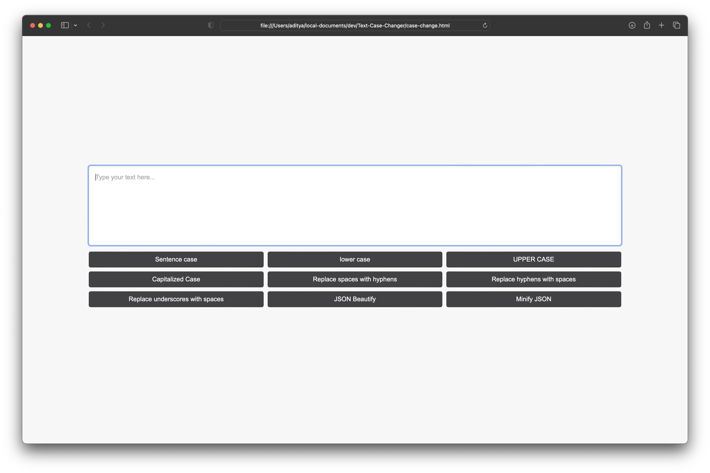

# Text Case Changer

Text Case Changer is a simple web application that allows users to change the text case of their input within a textarea. Users can convert their text to different formats such as Sentence case, lower case, UPPER CASE, and Capitalized Case. Additionally, the application provides the option to replace spaces with hyphens in the text.



## Features

- A responsive and user-friendly interface designed with HTML, CSS, and JavaScript.
- Four buttons to convert text to Sentence case, lower case, UPPER CASE, and Capitalized Case.
- A button to replace spaces with hyphens in the input text.
- Text transformation occurs within the textarea without the need for page reloads.

## Getting Started

### Prerequisites

- A modern web browser such as Google Chrome, Firefox, or Microsoft Edge.

### Installation

1. Clone the repository to your local machine:

```
git clone https://github.com/adityasatalkar/Text-Case-Changer.git
```

2. Open the index.html file in your preferred web browser.

### Usage

1. Type or paste your text into the textarea.
2. Use the buttons to change the text case or replace spaces with hyphens as needed.

### Contributing

Pull requests are welcome. For major changes, please open an issue first to discuss what you would like to change.

Please make sure to update tests as appropriate.

License

MIT